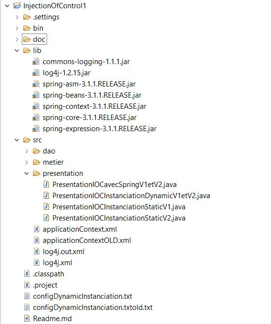
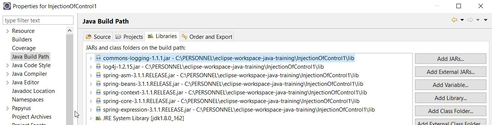

# Injection of control (IOC ) ( injection de dépendance )
Le principe général de l'injection des indépendances est d'instancié au démarrage de l'application  les objets. On peut donc à loisir choisir les objets que l'on souhaite intégré à l'application sans pour autant apporter une quelques modification à l'application ( main ). Ceci est fait par la lecteur de fichiers de configurations contenant les objets devant d’être instanciés au démarrage.

 - Une application doit être fermer à la modification mais restée ouverte à l'extension. 
 - Il faut s'efforcer de coupler faiblement les objets entre eux. 
 - Il faut s'efforcer d'utiliser les interfaces lors de la programmation et non son implémentation.

Il faut donc privilégier l'utilisation du **frameWork spring** ou **l'instanciation dynamique**. Il n'est pas préconiser d'utiliser l'instanciation statique.

[Principe de l'inversion de contrôle ou Injection des dépendances IOC Miage SID 30 01 14](https://www.youtube.com/watch?v=RKgSU-NW9I0)


## A)  Architecture

### 1)  Instanciation statique

L'instanciation statique d'objets ne permet pas à l'application ( Application main ) d’être fermer à la modification et ouverte à l'extension  car l’évolution de l'application ( une nouvelle version ou bug du metier ) nécessite l'instanciation du nouvel objet en remplacement de l'ancien.  L'instanciation est faite au niveau de la compilation.


**Il n'est pas préconisé donc dans un contexte professionnel d'utiliser l'instanciation statique.**


#### Instanciation de l'application version 1

Dans cette exemple nous instancions statiquement les objets **MetierImplementV1** et **DaoImplementV1**  via **new**. L'évolution de cette application nécessite l'instanciation des nouveaux objets **MetierImplementV2** et **DaoImplementV2** (s'ils sont tous deux modifier ).


```java
package presentation;

import dao.DaoImplementV1;
import metier.MetierImplementV1;

public class PresentationIOCInstanciationStaticV1 {

	// ici dans l'instance static on ne peut faire
	// evoluer l'application. Sinon il faut recrire le code pour
	// implementer la version 2.
	public static void main(String[] args) {
		// TODO Auto-generated method stub
		
		// injection de dependance IOD par une instanciation static
		// ce n'est pas la meilleur façon de faire. Il faut plutot
		// le faire par une instanciation dynamique des objects
		MetierImplementV1 metier=new MetierImplementV1();
		DaoImplementV1 dao = new DaoImplementV1();
		
		metier.setDao(dao);
		
		System.out.println(metier.calcul());
	}

}
```

#### Instanciation de l'application version 2

Evolution de l'application de la version 1 vers la version 2.  Nous sommes contraint ici d'instancier les nouveaux objets **MetierImplementV2** et **DaoImplementV2** pour prendre compte les nouvelles modifications apporter au implementation **Metier** et **Dao**.

```java
package presentation;

import dao.DaoImplementV2;
import metier.MetierImplementV2;

// Faire evoluer l'application V1 en V2
public class PresentationIOCInstanciationStaticV2 {

	// ici dans l'instance static on ne peut faire
	// evoluer l'application. Il a fallut recrire le code pour
	// implementer la version 2.
	public static void main(String[] args) {
		// TODO Auto-generated method stub
	
		// injection de dependance IOD par une instanciation static
		// ce n'est pas la meilleur façon de faire. Il faut plutot
		// le faire par une instanciation dynamique des objects
		MetierImplementV2 metier=new MetierImplementV2();
		DaoImplementV2 dao = new DaoImplementV2();	
				
		metier.setDao(dao);
		System.out.println(metier.calcul());
	}
}

```
### 2) IOC ( Instanciation dynamique des objets )

Ici nous utilisons un fichier de configuration qui indique les Classes d’implémentations  à utiliser lors du démarrage de notre applications Au démarrage de l'application les objets seront instanciés.  En cas d'extension de l'application il nous suffit de remplacer les anciennes implémentations par les nouvelles.

```java
package presentation;

import java.io.File;
import java.lang.reflect.Method;
import java.util.Scanner;

import dao.IDao;
import metier.IMetier;

// avec l'instance dynamic on est capable de de choisir au demarrage
// de l'application quelle version instancier des objects. Ainsi l'application
// main reste inchanger. Le seul changement a faire est de modifier le fichier
// configDynamicInstanciation.txt
public class PresentationIOCInstanciationDynamicV1etV2 {

	public static void main(String[] args) {
		try {
			Scanner  scanner=new Scanner(new File("configDynamicInstanciation.txt"));
			
			// instanciation dynamique d'une objet dao. 
			// Lecture depuis un fichier
			// puis creer un object dao
			// equivalent en statique à
			//  DaoImplementV1 dao = new DaoImplementV1();
			String daoClassName =  scanner.next();
			System.out.println("daoClassName: "+ daoClassName );
			Class cDao = Class.forName(daoClassName);		
			IDao dao=(IDao) cDao.newInstance();
			System.out.println(dao.getTemperature());
			
			// instanciation dynamique d'une objet metier. 
			// Lecture depuis un fichier
			// puis creer un object metier
			// equivalent en statique à 
			//     MetierImplementV1 metier=new MetierImplementV1();
			String MetierClassName = scanner.next();
			System.out.println("MetierClassName: "+ MetierClassName );
			Class cMetier = Class.forName(MetierClassName);
			IMetier metier= (IMetier) cMetier.newInstance();
			
            // use methode equivalent à satique:  
			//   metier.setDao(dao);
			Method m = cMetier.getMethod("setDao", new Class[] {IDao.class});
			m.invoke(metier,new Object[] {dao} ) ;
			
			System.out.println(metier.calcul());
			
		} catch (Exception e) {
			
			// TODO Auto-generated catch block
			e.printStackTrace();
		}	
	}
}
```

Configuration initiale du fichier  **configDynamicInstanciation.txt**

```bash
> cat configDynamicInstanciation.txt
dao.DaoImplementV1 
metier.MetierImplementV1
```

En cas d'extension de l'application par l'évolution des implémentations des interfaces **IDao** et **IMetier**, changer le fichier de configuration **configDynamicInstanciation.txt** en ajouter les nouvelles implémentations des interfaces.

```bash
> cat configDynamicInstanciation.txt
dao.DaoImplementV2 
metier.MetierImplementV2
```

### 3) IOC via Framework spring

Le principe consiste à déléguer au framework **spring** l'instanciation des objets et l'affectation des objets.

Fichier de configuration xml Spring **applicationContext.xml**.

**d** et **metier** sont les variables d'instanciation des implémentations des classes **dao.DaoImplementV1** et  **metier.MetierImplementV1**.

la **property name="dao"** fait appelle automatique au setter **setDao** dans l'implementation **metier.MetierImplementV***. C'est la raison pour laquelle un contructor au moins vide est nécessaire.

En cas d'extension de l'application il faudra changer par les nouvelles implémentation ( par exemple changer **metier.MetierImplementV2**

```xml
> cat applicationContext.xml

<?xml version="1.0" encoding="UTF-8"?>
<beans xmlns="http://www.springframework.org/schema/beans"
	xmlns:xsi="http://www.w3.org/2001/XMLSchema-instance"
	xsi:schemaLocation="
        http://www.springframework.org/schema/beans http://www.springframework.org/schema/beans/spring-beans.xsd">


	<bean id="d" class="dao.DaoImplementV1"></bean>
	<bean id="metier" class="metier.MetierImplementV1">
		<property name="dao" ref="d"></property>
	</bean>
</beans>
```

Ici dans le programme on peut utiliser deux méthodes pour lire le fichier **applicationContext.xml** via **ClassPathXmlApplicationContext** ou **BeanFactory**. Utiliser une des deux.

```java
package presentation;

import java.io.File;
import java.io.IOException;
import java.io.InputStream;
import java.net.URI;
import java.net.URL;

import org.springframework.beans.factory.BeanFactory;
import org.springframework.beans.factory.xml.XmlBeanFactory;
import org.springframework.context.support.ClassPathXmlApplicationContext;
import org.springframework.core.io.ClassPathResource;
import org.springframework.core.io.Resource;

import metier.IMetier;

// necessite la configuration du fichier ApplicationContext.xml
public class PresentationIOCavecSpringV1etV2 {
	
	public static void main(String[] args) {
		// TODO Auto-generated method stub

		ClassPathXmlApplicationContext context=
				new ClassPathXmlApplicationContext(new String[] { "applicationContext.xml" }) ; 

		IMetier metier= (IMetier) context.getBean("metier");

		System.out.println(metier.calcul());	
		
		// OU AUTRE FACON DE FAIRE
		
		//BeanFactory bf = new XmlBeanFactory(new ClassPathResource("applicationContext.xml")); //
	    
		//IMetier metier2= (IMetier) bf.getBean("metier");
		System.out.println(metier2.calcul());	
	}
}
```
En cas d'extension de l'application par l'évolution des implémentations des interfaces **IDao** et **IMetier**, changer le fichier de configuration **applicationContext.xml** en ajouter les nouvelles implémentations des interfaces.


```xml
> cat applicationContext.xml

<?xml version="1.0" encoding="UTF-8"?>
<beans xmlns="http://www.springframework.org/schema/beans"
	xmlns:xsi="http://www.w3.org/2001/XMLSchema-instance"
	xsi:schemaLocation="
        http://www.springframework.org/schema/beans http://www.springframework.org/schema/beans/spring-beans.xsd">


	<bean id="d" class="dao.DaoImplementV2"></bean>
	<bean id="metier" class="metier.MetierImplementV2">
		<property name="dao" ref="d"></property>
	</bean>
</beans>
```


## B) Configuration du projet ( java program )

>   java program project



>  Configuration des spring jar.




